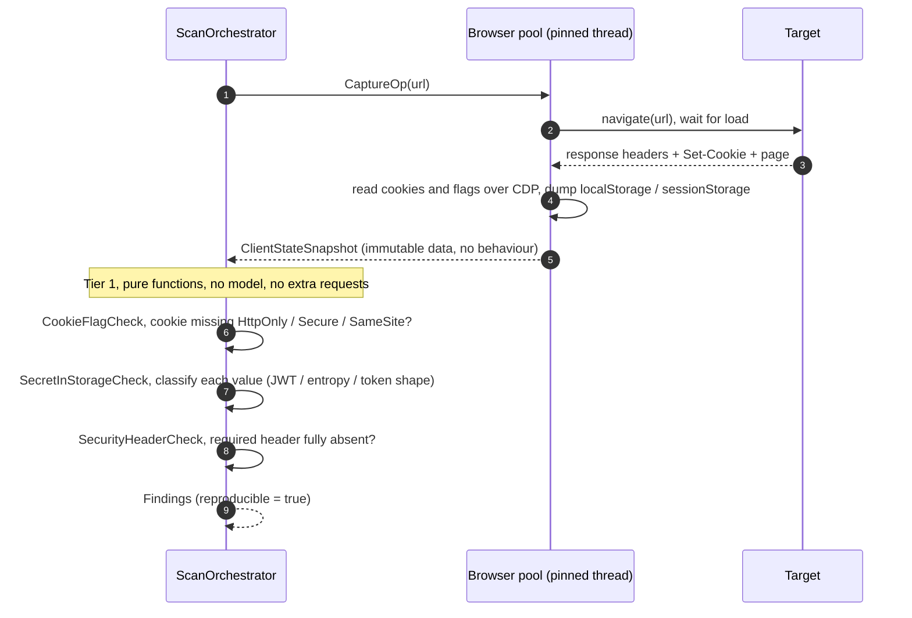
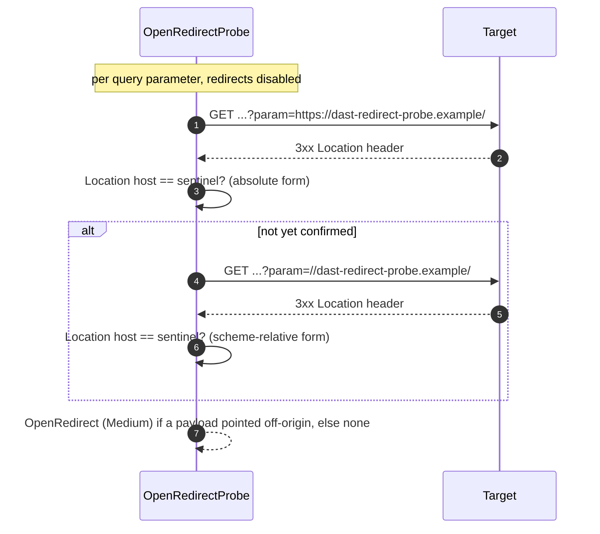
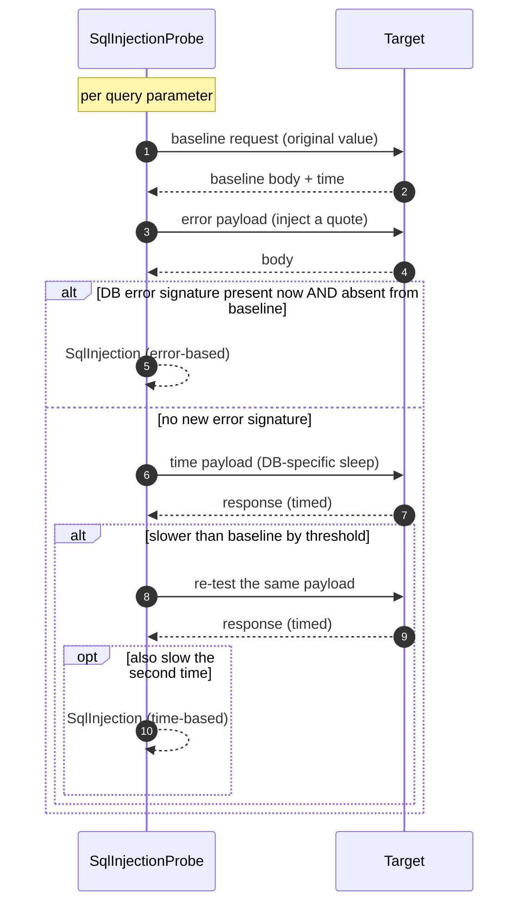
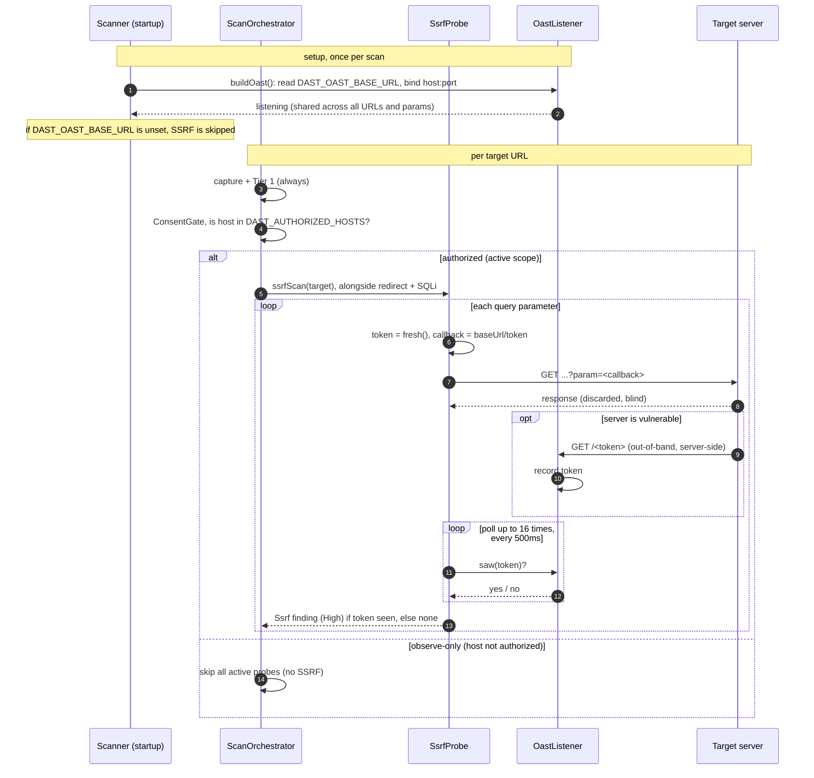
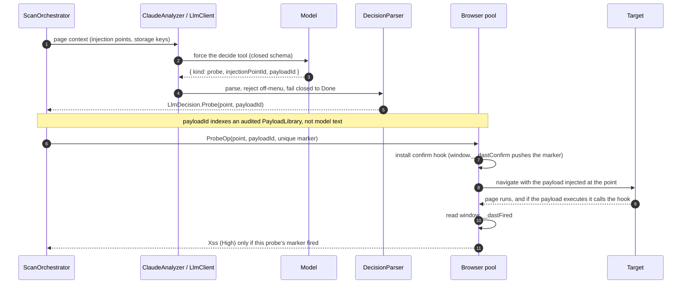
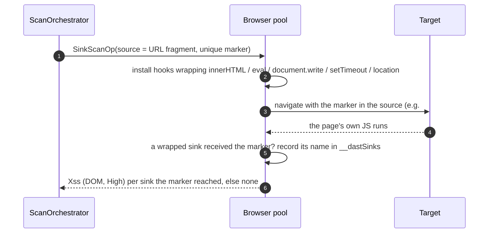
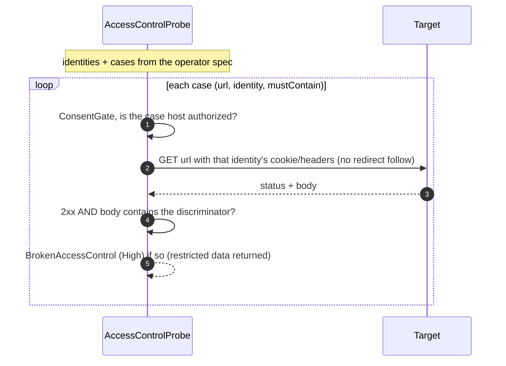
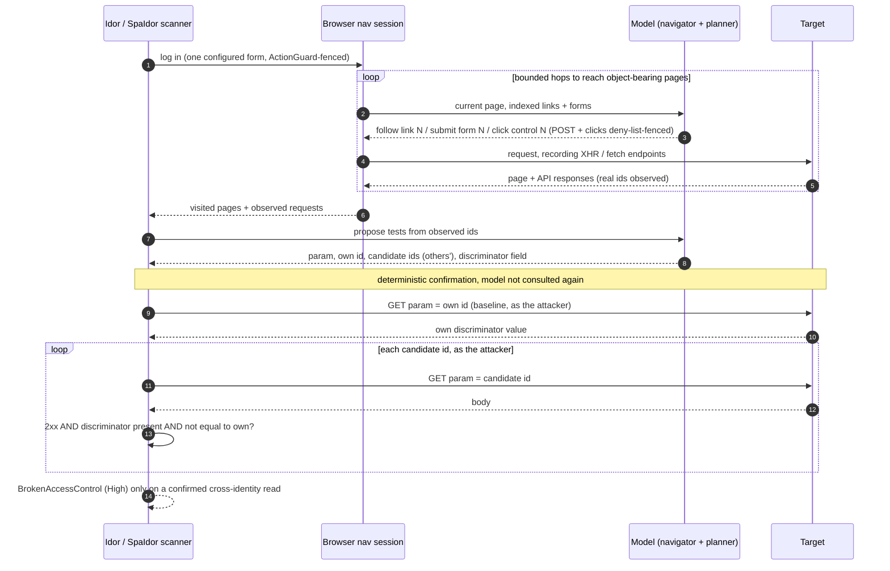
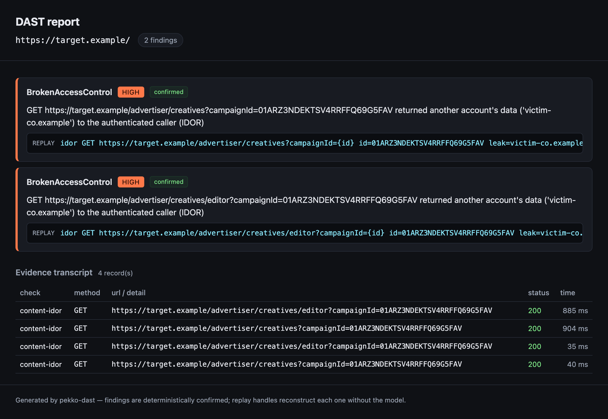

[English](README.md) | 日本語

> この日本語版は [README.md](README.md) の翻訳です。正本は英語版で、内容が遅れる場合があります。

# pekko-dast

[Apache Pekko](https://pekko.apache.org/) と [Playwright](https://playwright.dev/java/) の上に構築した、ブラウザ駆動・LLM 主導の **動的アプリケーションセキュリティテスト (DAST)** エンジンです。許可された 1 つの URL をスキャンする（あるいはシードからクロールしてスコープ内の各 URL をスキャンする）もので、決定的なセキュリティチェックと、実行による確認を伴う能動的プローブを組み合わせ、構造化された再現可能な検出結果を出力します。

ブラウザが必要な箇所（キャプチャ、XSS の実行、認証付き SPA のナビゲーションとログイン）では実際の Chromium を駆動し、不要な箇所（オープンリダイレクト、SQLi、SSRF、IDOR の確認）では素の HTTP を使います。全体を通じて 2 つの原則が貫かれています。1 つは **ホストを許可するまでは観測のみ**（能動的プローブは `DAST_AUTHORIZED_HOSTS` に対する `ConsentGate` でゲートされます）。もう 1 つは **モデルは提案するだけで、確認は決定的なコードが行う**（LLM は閉じたツールスキーマを埋めるだけで実行コードを書かず、決定的な確認なしに検出結果は生まれません）。実行方法は下記の「スキャンの実行」を参照してください。

---

## 検出できる脆弱性

| チェック | Kind | 種別 | 確認方法 | ブラウザ | LLM |
|---|---|---|---|---|---|
| 安全でない Cookie | `InsecureCookie` | 決定的 | CDP 経由で Cookie のフラグを読む | はい（キャプチャ） | いいえ |
| ストレージ内の機密情報 | `SecretInStorage` | 決定的 | キー/値の分類 | はい（キャプチャ） | いいえ |
| 不足しているセキュリティヘッダ | `MissingSecurityHeader` | 決定的 | レスポンスヘッダを読む | はい（キャプチャ） | いいえ |
| オープンリダイレクト | `OpenRedirect` | 能動的・許可制 | 追従なしリクエストで `Location` が番兵を指すか | いいえ（HTTP） | いいえ |
| SQL インジェクション | `SqlInjection` | 能動的・許可制 | ベースライン差分のエラー痕跡、または再試行した遅延 | いいえ（HTTP） | いいえ |
| SSTI（サーバサイドテンプレートインジェクション） | `Ssti` | 能動的・許可制 | 特徴的な算術がサーバ側で評価される（反射ではない） | いいえ（HTTP） | いいえ |
| パストラバーサル / LFI | `PathTraversal` | 能動的・許可制 | 既知の OS ファイルの痕跡が返る（ベースラインには無い） | いいえ（HTTP） | いいえ |
| CORS 設定不備 | `Cors` | 能動的・許可制 | 偽装した `Origin` が反射される（認証情報付きが最悪） | いいえ（HTTP） | いいえ |
| JWT の弱点 | `JwtWeakness` | 決定的 | `alg:none`、または弱い HMAC 秘密鍵をオフラインで解読 | はい（キャプチャ） | いいえ |
| SSRF | `Ssrf` | 能動的・許可制 | 自前リスナーへのアウトオブバンドコールバック | いいえ（HTTP） | いいえ |
| 反射型 XSS | `Xss` | 能動的・許可制 | ペイロードがブラウザで実行される（マーカー発火） | はい | はい（誘導） |
| DOM XSS（シンク到達） | `Xss` | 能動的・許可制 | 注入したマーカーが危険な DOM シンクに到達 | はい | いいえ |
| アクセス制御 / IDOR（仕様駆動） | `BrokenAccessControl` | 能動的・許可制・要設定 | ある識別情報で要求して制限データが返る | いいえ（HTTP） | いいえ |
| IDOR（LLM 立案） | `BrokenAccessControl` | 能動的・許可制 | 呼び出し元のものでないレコードが返る | ログイン+ナビ+クリック | はい（立案・探索・クリック） |

---

## 各チェックの仕組み

すべての能動的チェックは最初にゲートされます。`ConsentGate` は対象ホストが `DAST_AUTHORIZED_HOSTS` に含まれる場合のみプローブを許可し、そうでなければ観測のみになります。以下の図はこのゲートを通過した前提です。

### キャプチャベースの決定的チェック（Cookie・ストレージ・ヘッダ）

**攻撃の概要。** 1 回のページ読み込みで明らかになる 3 種類の弱点です。

- **安全でない Cookie。** `HttpOnly` のないセッション Cookie は JavaScript から読めます（XSS があればセッションを奪われます）。`Secure` がなければ平文 HTTP で漏れ得ます。`SameSite` がなければクロスサイトリクエストに付随して送られます（CSRF の足がかり）。
- **ストレージ内の機密情報。** JWT・API キー・アクセストークンを `localStorage` / `sessionStorage` に置くアプリは、`HttpOnly` Cookie と違ってページ上の任意のスクリプトに晒します。XSS が 1 つあればすべて読まれます。
- **不足しているセキュリティヘッダ。** `Content-Security-Policy`・`Strict-Transport-Security`・`X-Content-Type-Options`・`Referrer-Policy`・フレーム制御が無いと、標準的な多層防御を欠いた状態になります。

**ツールの確認方法。** 3 つとも決定的で、**1 回**の受動的キャプチャから読み取ります。`CaptureOp` がページを読み込み、不変の `ClientStateSnapshot`（レスポンスヘッダ、CDP 経由のフラグ付き Cookie、ストレージのマップ）を記録します。モデルも追加リクエストも許可も不要です（通常の訪問で既に見える情報です）。続いて `Tier1.run` が 3 つの純粋関数を適用します。`CookieFlagCheck`（フラグが欠けた Cookie ごとに 1 件）、`SecretInStorageCheck`（各値を JWT 構造・エントロピー・既知のトークン形状で分類し、base64 文字列を片端から挙げずに機密らしきものだけを挙げる）、`SecurityHeaderCheck`（完全に欠落しているヘッダのみを挙げ、誤検知をほぼゼロに保つ）。すべての検出結果は `reproducible = true` です。



### オープンリダイレクト

**攻撃の概要。** オープンリダイレクトとは、アプリがリクエストパラメータ（`?next=`・`?url=`・`?returnTo=` など名前は様々）から受け取った URL へ、サイト内に留まるか検証せずにブラウザを転送してしまうものです。リンクは **信頼ドメインで始まり**、攻撃者のサイトに着地するため、説得力のあるフィッシングに使え、改ざんした `redirect_uri` で OAuth トークンを漏らし得ます。単体では踏み台に過ぎないため重大度は `Medium` です。

**ツールの確認方法。** 純粋な HTTP のみ、ブラウザは使いません。URL に既にある各クエリパラメータについて、`OpenRedirectProbe` は番兵ホスト（`dast-redirect-probe.example`、予約済みで名前解決されない TLD なので実際に対象から外へ出ることはありません）を 2 つの形で注入します。絶対形 `https://sentinel/` と、スキーム相対形 `//sentinel/`（後者は素朴な `startsWith("/")` による許可リストを破ります）。リダイレクト追従を **無効化** して送信し、`Location` ヘッダを読みます。そのホストが番兵なら、そのパラメータはオリジン外リダイレクトを制御していることになります。パラメータ名は問わず、URL に既にあるものだけを試します。



### SQL インジェクション

**攻撃の概要。** ユーザー入力をパラメータ化せずに SQL 文へ連結すると、攻撃者はクエリ自体を書き換えられます。他人の行を読む、テーブルをダンプする、別人としてログインする、さらに悪い操作も可能です。データを見ずとも 2 つの兆候で分かります。余分な引用符がクエリを壊す（ページが **データベースエラー** を返す）か、注入した `SLEEP` / `pg_sleep` で応答が明らかに **遅くなる** かです。

**ツールの確認方法。** 純粋な HTTP。各クエリパラメータについて、ベースラインリクエストと比較しつつ `SqlInjectionProbe` が 2 つの確認を順に試します。

1. **エラーベース。** 引用符を注入し、**ベースラインには無かった** 既知の DB エラー痕跡が応答に現れたら確定（ベースライン比較により、ページが常に出すエラーの誤検知を避けます）。
2. **時間ベース**（エラーベースが発火しなかった場合のみ）。DB 固有のスリープペイロードを送り、注入リクエストがベースラインよりしきい値ぶん遅く、**かつ再試行も遅い** 場合のみ確定（1 回の遅延はノイズ、2 回ならペイロードです）。

パラメータごとに最初に確定した手法を採用します。失敗したリクエストが検出を捏造することはありません。



### SSRF（アウトオブバンド確認）

**サーバサイドリクエストフォージェリ (SSRF)** とは、攻撃者が **サーバ自身** に任意の宛先へリクエストを送らせるものです。危険なのはサーバの居場所です。内部限定のサービス（`http://localhost/...` の管理画面やデータベース）、クラウドのメタデータ（`http://169.254.169.254/...`、IAM 認証情報を返す）に到達でき、そのリクエストは信頼されたサーバ発なのでファイアウォールや IP 許可リストをすり抜けます。よくあるパラメータ: `url`・`uri`・`src`・`dest`・`image`・`webhook`・`callback`・`proxy`。

SSRF の多くは **ブラインド** です。サーバはリクエストを行うものの観測可能なものは何も返さないため、応答本文を見ても当てになりません。唯一の誠実な手がかりは **アウトオブバンド** です。自分が制御するリスナーを指す、一意のトークンを載せた URL を対象に渡し、リスナーが叩かれるかを見ます。叩かれれば、サーバが攻撃者の選んだ URL を取得したことが実証されます。

### 全体の流れ

1. **セットアップ（スキャンごとに 1 回）。** `Scanner.buildOast` が `DAST_OAST_BASE_URL` を読み、**いかなるプローブよりも前に** そのホスト/ポートで `OastListener` をバインドし、`ssrfScan` エフェクトとして組み込みます。このリスナーは長命で、スキャン中のすべての URL とパラメータで共有されます。ベース URL は対象から到達可能でなければなりません（ローカル対象ならループバック、ホスト型対象ならパブリック/トンネルのアドレス）。未設定なら `ssrfScan` は何もせず、SSRF はスキップされます（推測はしません）。
2. **ゲート（対象 URL ごと）。** キャプチャと Tier 1 チェックの後、`ScanOrchestrator` が `ConsentGate` にホストが `DAST_AUTHORIZED_HOSTS` にあるか問い合わせます。観測のみ（未許可ホスト）なら SSRF を含む能動的プローブをすべてスキップします。
3. **実行（許可時）。** ブラウザ不要の 3 つの HTTP プローブ（オープンリダイレクト・SQLi・SSRF）が一緒に走り、`ssrfScan(target)` が `SsrfProbe.scan(target, listener)` を呼びます。
4. **プローブ（クエリパラメータごと、名前は問わない）。** 一意のトークンを生成し、`baseUrl/token` をそのパラメータに注入し、対象へ GET を撃ち、**応答は破棄** します（ブラインド SSRF はそこに何も漏らしません）。その後 `listener.saw(token)` を 500ms 間隔で最大 16 回ポーリングします（遅いサーバ側取得に備えた約 8 秒の窓）。
5. **確認。** 対象サーバがコールバックを取得していれば、共有リスナーが既にトークンを記録しており、ポーリングがそれを見て `High` の検出結果を出します（再現用ハンドルはトークン）。窓内にコールバックが無ければ検出なし。パラメータごとに一意なトークンにより、コールバックは正確にその入力に帰属します。



**制限事項:** URL に既にあるクエリパラメータのみ（本文やパスの SSRF、パラメータ探索は行わない）、GET かつ HTTP コールバックのみ（DNS 解決のみを起こす SSRF は捕捉しない）、ポーリング窓は非常に遅いサーバ側取得を取り逃すことがある、そして脆弱性の確認は行うが昇格はしない（メタデータの読み出しや内部ポートスキャンは行わない）。

### 反射型 XSS（LLM が誘導し、ブラウザが確認する）

**攻撃の概要。** 反射型クロスサイトスクリプティングは、アプリがリクエストパラメータをエンコードせずページに反映するため、攻撃者が細工した値が被害者のブラウザで生きたスクリプトになるものです。Cookie やトークンを盗む、ユーザーとして操作する、ページを書き換えるなどが可能です。「反射型」とは、ペイロードがリクエストに乗って届く（被害者がクリックする細工リンク）ことを指し、サーバに保存されるものではありません。

**ツールの確認方法。** これはモデルが *誘導* する唯一のチェックですが、モデルがコードを書くことはありません。`ClaudeAnalyzer` がページのコンテキストを送り、閉じた `decide` ツールを強制します。モデルは `Probe(injectionPoint, payloadId)` を返し得ますが、`payloadId` は **監査済みの `PayloadLibrary`** を指すだけです（モデルは id を選ぶのみで、ペイロード本文は書きません）。`DecisionParser` はメニュー外を拒否し、`Done` にフェイルクローズします。続いて決定的な部分がブラウザスレッドで走ります。`ProbeOp` が確認用フック（`window.__dastConfirm(marker)` が一意のマーカーを push）を仕込み、選ばれたペイロードを注入してナビゲートし、`window.__dastFired` を読み戻します。**そのプローブのマーカーが発火集合に入っている場合のみ**、つまりペイロードが実際に実行された場合のみ検出結果になります。再現用ハンドルは注入点とペイロード id なので、モデル呼び出し無しで再現できます。



### DOM XSS（シンク到達）

**攻撃の概要。** DOM ベース XSS は完全にクライアント側で起きます。ページ自身の JavaScript が攻撃者の影響し得る入力（URL フラグメント、クエリ文字列、`postMessage` といった「ソース」）を読み、サニタイズせずに危険な「シンク」（`innerHTML`・`eval`・`document.write`・文字列の `setTimeout`・`location`）へ書き込みます。サーバの反射が関与しないため、サーバ側のチェックでは完全に見落とされます。

**ツールの確認方法。** ペイロードを発火させるのではなく **テイント観測** によります。`SinkScanOp` は危険なシンクをラップする init スクリプトを仕込み、各シンクが **一意で無害な英数字マーカー**（不活性。マークアップも状態変更も無し）を含む値を受け取ったらその名前を記録するようにします。そのマーカーをソース（URL フラグメント）経由で届け、ページ自身の JS を走らせ、`window.__dastSinks` を読み戻します。アプリがマーカーをソースからシンクへ流していれば、そのソースからシンクへの流れが再現可能な DOM XSS の指標になります。マーカーは *到達性* を示すだけなので、実行可能ではなく無害に保たれます。再現はソースとシンクです。



### アクセス制御 / IDOR（オペレータ仕様、要設定）

**攻撃の概要。** 壊れたアクセス制御とは、呼び出し元が要求した操作を許可されているかをアプリが確認しないことです。**IDOR**（安全でない直接オブジェクト参照）はよくある形で、リクエスト中の id を変える（`/account?id=123` を `124` に）と他人のデータが得られます。関連する形として、低権限ユーザーが管理 URL に到達する、未認証リクエストが保護ページに到達する、などがあります。

**ツールの確認方法。** これは唯一 **要設定** のチェックです。何が制限されるべきかをスキャナは知り得ないためです。オペレータが識別情報（それぞれ取得済みの `cookie` / `headers`、またはスキャナが 1 度だけ送信してセッションを得る `login` フォーム）と、検証ケースの JSON 仕様を与えます。ケースは「`url` を `identity` として（または未認証で）要求したとき `mustContain`（制限データが返ったことを示す判別文字列）を返してはならない」と述べます。`AccessControlProbe` はケースごとにその識別情報の資格で 1 リクエストを送り、**リダイレクト追従は無効**（ログインページへの転送は成功でなく拒否と読む）、各ケースは `ConsentGate` でゲートされます。検出が確定するのは **2xx かつ本文に判別文字列を含む** 場合のみです。再現はケース名・識別情報・URL です。



### IDOR（LLM による立案・探索）

**攻撃の概要。** 壊れたオブジェクトレベル認可（IDOR）は [OWASP API セキュリティ Top 10 の第 1 位](https://owasp.org/www-project-api-security/)であり、自動検出が最も難しい脆弱性クラスです。SQLi・XSS・オープンリダイレクトと違い、**構文上の手がかりが無い**のです。脆弱な応答は正当なものとまったく同じ形をした素の `200 OK` で、それを区別するのは所有権の *意味論* ——*このレコードは呼び出し元のものではない*—— だけ。スキャナはパターン照合で辿り着けず、だからこそ IDOR は今なお主に手作業で発見されるクラスです。これを決定的に確認することこそ、本ツールが解く面白い問題です。これは上記の仕様駆動チェックと同じ壊れたアクセス制御クラスですが、その手法が届かない難しい状況です。オブジェクト id が **推測不能**（ランダムな ULID / UUID なので `123` を `124` と列挙できない）で、脆弱なエンドポイントが **自明でない**（リンククロールでは見えない SPA の XHR / fetch API）。テストするには別ユーザーに属する *実在の* id が必要で、それを運ぶページや API 呼び出しに到達する必要があります。

**ツールの確認方法。** ここはモデルが本当に要となる唯一の箇所です——ただし *到達と提案* のためだけで、*確認は決定的なコード* が行います。3 段階です。

**1 — オブジェクトに到達する。** ログイン（認証付きスキャンの例外規定）から、スキャナは 3 つの方法でオブジェクトを持つページに到達します。

- **`AuthCrawl`** — 決定的な同一ホストのリンククロール。
- **`NavLoop`** — モデルがホップごとに索引付き要素から 1 つだけ選ぶ（リンク追従かフォーム送信）。クロールでは届かない一覧に到達します。すべての送信は `ActionGuard` を通ります。GET は常に許可、POST はモデルが安全と判定し **かつ** 破壊的パターンの拒否リストを通過した場合のみ（モデルの判定は必要条件だが十分条件ではない）。
- **`ClickLoop`**（SPA のみ） — リンク/フォームのクロールでは到達できないボタン依存の UI をブラウザがクリックし、あるいは行を追加読み込みするためにスクロールします。`ClickTargetScanOp` が表示中の操作要素を列挙し（各要素に `data-dast-id` を付与）、モデルは *セレクタではなく id で* 1 つ選びます。ループは 3 つの方法で制限されます——ページ間で共有するクリック予算、要素の同一性（再付番される id ではなく）でキー付けした循環ガード、ページ内 DOM の変化を進捗とみなす空振りカウンタ。各クリックは `ClickGuard` で選別され、`ConsentGate` でゲートされます。

全体を通して、ブラウザはアプリが呼ぶ XHR / fetch エンドポイントを記録します。

**2 — 立案する。** プランナ（`IdorPlanner` / `ContentIdorPlanner`）が、**実際に観測した id から**、パラメータ・呼び出し元自身の値・候補 id（2 識別情報フローでは別アカウント由来）・ユーザーごとの判別フィールドを提案します。

**3 — 確認する（決定的）。** `IdorProbe` / `ContentIdorProbe` が呼び出し元自身の値でベースラインを取り、各候補を **呼び出し元として** 要求します。確認の手がかりは 2 つです。

- **JSON API** — ユーザーごとの **判別フィールド** が呼び出し元自身と **異なる値で存在** すれば確定（=他人のレコード）。
- **HTML / SPA**（差分を取れるフィールドが無い） — **リークマーカー**、すなわち被害者の *データの指紋*。`ContentIdor.markersFrom` が、*相手* アカウントのページには現れるが呼び出し元自身のページには現れない、短く特徴的なデータトークン（メールアドレス、ブランドのドメインなど）を抽出するため、共有の定型物（アプリのブランド、CDN）は脱落します。検出には、その被害者固有のトークンが候補への応答に現れ、**かつ** 呼び出し元のベースラインには無いことが必要です（=被害者自身のデータが境界を越えた）。

対象の id と一致するマーカーは却下されます（id はリークの有無に関わらずページに反射するだけで何も証明しない）ので、確認は *データ* に基づき、問い合わせた鍵そのものには基づきません。モデルは検出を捏造できず（堅牢なエンドポイントは差分を生まない）、破壊的操作も起こせません（拒否リストの最終防壁）。再現はパラメータ・値・フィールドで、モデルは不要です。



検出結果は kind・重大度・evidence（根拠）・`reproducible` フラグ・モデル無しで再現できる `replay`（再現用）ハンドル（例: `header:content-security-policy@<url>`）を持ちます。

---

## アーキテクチャ

Playwright Java のドライバはシングルスレッドなので、ブラウザは **スレッド親和なリソースプール** にホストされます。エンジンの残りは、上の図が参照する決定的チェックと LLM の継ぎ目（seam）です。

- **`ResourcePool[R]` / `ResourceSession[R]`**（`src/main/scala/crawler/pool`）: 汎用のノードローカルなプール。各セッションは 1 つの `AutoCloseable` リソースを自身の `PinnedDispatcher` スレッド上で所有し、投入された処理をすべてそこで実行します。呼び出し側は `pool.submit` で型付きの `Future[T]` を得ます。スキャンの並行度によらず Chromium プロセス数はプールサイズと一致し、すべての Playwright 呼び出しはブラウザを作ったスレッド上に留まります。
- **`BrowserResource`**（`src/main/scala/crawler/BrowserResource.scala`）: 1 スレッドに固定された 1 つの Playwright + Chromium。識別可能な起動（ステルスではなく `pekko-dast-scanner` の User-Agent と `X-Scanner` ヘッダ）、`withPage` キャプチャ op、Cookie/ログイン駆動の多段 SPA ナビゲーション用の永続 `nav*` セッション（リンク追従・フォーム送信・列挙した操作要素の `ClickGuard` で選別したクリック）。
- **`dast.analyzer.LlmClient`**: あらゆるモデルへの単一の境界。`callTool(system, user, ToolSpec, maxTokens) -> Option[tool-input]` で、`None` にフェイルクローズします。実装は Anthropic（既定）・OpenAI・Gemini で、`DAST_LLM_PROVIDER` で選びます。返すのはツール引数だけで確認は決定的なので、プロバイダの選択は再現率（recall）に影響しても健全性（soundness）には影響しません。
- **`dast.scan.*`**: オーケストレーション。URL 単位スキャン、サイトクロール、IDOR フローを担い、`Authorization` / `ConsentGate` がスコープを強制します。

重さについての注記: Pekko は数個の URL をスキャンするのに必要な以上に重厚です。クリーンな並行性と固定スレッド不変条件をもたらしますが、より単純なランタイムでも目的は果たせます。

---

## 検証済みのこと、未検証のこと

- **ライブ検証済み（同意のある、またはローカルの対象に対して）:** 安全でない Cookie、反射型 XSS、オープンリダイレクト、エラーベース SQLi、アウトオブバンド SSRF、アクセス制御 / IDOR、SSTI、パストラバーサル / LFI、CORS 設定不備、JWT 弱秘密鍵。`scripts/vuln-target.py` に対してエンドツーエンドで確認済み（同スクリプトは `/?q=` XSS、`/redirect?next=` オープンリダイレクト、`/item?id=` SQLi、`/fetch?url=` SSRF、`/account?id=` IDOR、`/admin` の認証欠如、`/greet?name=` SSTI、`/download?file=` パストラバーサル、`/api/data` CORS、弱秘密鍵の JWT Cookie を公開します）。
- **ユニットテスト済み（純粋ロジック）:** 各チェックの判定ロジック（SSTI（評価か反射か）、パストラバーサル（OS ファイル痕跡）、CORS（オリジン/認証情報の判定）、JWT（`alg:none` + オフラインの HMAC 弱秘密鍵解読）を含む）、判定パーサ、スコープ/フロンティア、スタブ化エフェクトでのオーケストレーションループ、各 LLM プロバイダのリクエスト構築とレスポンス解析、クリックループ（注入したエフェクトでの 予算 / 循環 / 空振り ガード、`ClickStep` の解析/描画境界、`ClickGuard` の破壊的フロアと `ClickOp` のゲート）。
- **ライブのみ（明記、ユニットテストなし）:** ブラウザ駆動の op 群、HTTP プローブ群、OAST リスナー、ライブのモデル呼び出し。実エンドポイントに対して走ったのは Anthropic クライアントのみで、OpenAI と Gemini のクライアントは結線・解析テスト済みだがライブ実行は未。ライブページ上のクリック op（`navEnumerateClickables` / `navClick`）は実行のみで、クリック自体は実在の認証付き SPA に対して発火・状態露出を確認済み（ただしサーバ描画で JS ゲート要素を持たないバンドル版 `scripts/vuln-target.py` に対しては未）。
- **実装・ユニットテスト済みだがライブ発火は未観測:** 時間ベース SQLi と DOM シンクスキャン。

---

## スキャンの実行

> テストする許可のあるシステムのみをスキャンしてください。能動的プローブは `DAST_AUTHORIZED_HOSTS` に列挙したホストに対してのみ行われ、それ以外は観測のみ（Cookie・ストレージ・レスポンスヘッダを読むだけ）です。

### 前提

- JDK 21 以上と sbt 1.10 以上（Scala 3 / Pekko / Playwright はビルドが管理します）。
- 初回実行時に Chromium を `~/.cache/ms-playwright` にダウンロードします（数分。以降は即時）。

### `.env` の設定

リポジトリ直下に `.env` を作成します。`DastConfig` がこれを `KEY=VALUE` として読みます（解決順: 実際の環境変数 → `.env` → JVM の `-D` プロパティ）。`export` は不要です。`.env` は gitignore 済みなので機密はここに置きます。

```dotenv
ANTHROPIC_API_KEY=sk-ant-...
DAST_AUTHORIZED_HOSTS=target.example
# DAST_OAST_BASE_URL=http://your-oast-listener
# DAST_LLM_PROVIDER=anthropic   # or: openai (OPENAI_API_KEY) / gemini (GEMINI_API_KEY)
```

| キー | 既定値 | 使用箇所 | 意味 |
|---|---|---|---|
| `DAST_LLM_PROVIDER` | `anthropic` | LLM 主導の全ステップ | プランナが呼ぶ API: `anthropic` / `openai` / `gemini`。 |
| `ANTHROPIC_API_KEY` | （なし） | アナライザ、IDOR/ナビのプランナ | LLM 主導ステップ（XSS 誘導、IDOR 立案、ナビ）。未設定ならそれらはフェイルクローズしてスキップ。決定的チェックは動きます。 |
| `ANTHROPIC_MODEL` | `claude-sonnet-4-6` | アナライザ、プランナ | モデル id（プロバイダが `anthropic` のとき）。既定は Sonnet：スキャン中で最も難しい判断であるクロスアカウント IDOR の確定を、Opus の約 1/5 のトークンコストで通す（より安価な Haiku 系は取りこぼすことが確認された）。最大限の推論には `claude-opus-4-8`、コスト最小化には Haiku 系を指定。 |
| `OPENAI_API_KEY` / `OPENAI_MODEL` | （なし） / `gpt-4o` | プロバイダが `openai` のとき | OpenAI のキーとモデル。 |
| `GEMINI_API_KEY` / `GEMINI_MODEL` | （なし） / `gemini-2.0-flash` | プロバイダが `gemini` のとき | Gemini のキーとモデル。 |
| `DAST_AUTHORIZED_HOSTS` | （なし → 観測のみ） | 全スキャナ main | 能動的に探査してよいホストのカンマ区切り。 |
| `DAST_OAST_BASE_URL` | （なし → SSRF スキップ） | SSRF チェック | 対象がコールバックできるアウトオブバンドリスナーのベース URL。 |
| `DAST_ACCESS_SPEC` | （なし） | Access / Idor / SpaIdor main | 引数で渡さない場合の仕様ファイルパス。 |
| `DAST_NAV_TIMEOUT_MS` | `30000` | ナビゲートする main | ナビゲーションごとのタイムアウト。 |
| `DAST_MAX_PAGES` | `20` | Site, Idor | クロールのページ上限。 |
| `DAST_MAX_DEPTH` | `2` | Site, Idor | クロールの深さ。 |
| `DAST_MAX_HOPS` | `4`（Idor） / `6`（SpaIdor） | Idor, SpaIdor | LLM ナビゲーションのホップ数。 |
| `DAST_POST_BUDGET` | `3` | Idor, SpaIdor | 1 回の実行での POST ナビゲーション上限。 |
| `DAST_MAX_CLICKS` | `8` | SpaIdor | ボタン依存の探索でページ間に共有するクリック予算（`0` でクリック無効）。 |
| `DAST_EVIDENCE_FILE` | （未設定→無効） | すべての main | JSON Lines の証跡を書き出すパス。対象への各 HTTP リクエスト（注入ペイロード・応答ステータス/ヘッダ/所要時間）と各 XSS の判定を記録し、スキャンの実施を証明・再現可能にします。未設定なら無効。 |
| `DAST_REPORT_FILE` | （未設定→無効） | すべての main | 自己完結型の HTML レポートを書き出すパス。検出結果（深刻度・根拠・replay ハンドル）に加えて上記の証跡を 1 ファイルにまとめ、ブラウザで開いたり共有したりできます。スキャンが既に生成した出力の読み取り専用ビューで、サーバは不要。未設定なら無効。 |
| `DAST_MAX_CONCURRENCY` | `4` | グローバル HTTP スロットル | 対象への同時リクエスト上限（バックプレッシャ）。 |

プロバイダの切り替えはコードではなく設定の変更です（3 つとも 1 つの `LlmClient` 継ぎ目を通ります）。確認が決定的なので、プロバイダの選択は再現率に影響しても健全性には影響しません。データに関する注記: どのプロバイダを選んでも、プランナは認証済みページの HTML と観測したリクエスト URL（実在のオブジェクト id を含む）をその API に送ります。これはプライバシー上の判断として扱ってください。

### 識別情報の仕様（spec）

IDOR とアクセス制御のスキャナは *誰かとして* 振る舞う必要があります。それは JSON 仕様（gitignore 済みの `*.local.json` に置く）から来ます。`AccessControlCheck.parseSpec` が解析します。

```json
{
  "identities": {
    "attacker": {
      "login": {
        "loginUrl": "https://target.example/login",
        "username": "alice@example.com",
        "password": "..."
      }
    },
    "victim": {
      "cookie": "session=eyJ...; csrf=..."
    }
  },
  "cases": [
    {
      "name": "advertiser reads another advertiser's campaign",
      "url": "https://target.example/api/campaign?id=VICTIM_ID",
      "identity": "attacker",
      "mustContain": "\"ownerId\":\"victim\""
    }
  ]
}
```

各 **識別情報** は次のいずれか 1 つでセッションを与えます。

- **`cookie`**: ログイン後にブラウザの devtools からコピーした生の `Cookie` ヘッダ値。最も確実（MFA やフィールド検出の問題が無く、パスワードもファイルに置かない）。`headers`（例: `{"Authorization": "Bearer ..."}`）はトークン認証で同様に使えます。
- **`login`**: `loginUrl` + `username` + `password`。スキャナがその 1 つの実ログインフォームを送信します（これだけが行う自動送信。フィールド検出は決定的）。

2 つの利用側の使い方:

- **`AccessScannerMain`** は **`cases`** 配列を実行します。各ケースは `url` を `identity` として（`identity` が `null` なら未認証で）要求し、応答が 2xx かつ本文に `mustContain` を含めば検出です。`cases` は空でも構いません。
- **`IdorScannerMain` / `SpaIdorScannerMain`** は `cases` を無視し、**identities** のみを使います。`attacker` という名前のもの（識別情報が 1 つだけならそれ）と、任意の `victim` を探します。`victim` があれば 2 識別情報テストになります。両方でログインし、`victim` のオブジェクト id を集め、`attacker` として認証したまま読めるか試します。

### シード URL の選び方

`ScannerMain` / `SiteScannerMain` では、URL 引数は単にスキャンするページ（またはクロールのシード）で、探査したいクエリ文字列（`...?id=1&q=x`）を含めます。

`SpaIdorScannerMain` / `IdorScannerMain` では、URL は **ログイン後に探索する** ページです。ログイン自体は仕様の `loginUrl` から来るので、この引数ではありません。オブジェクトが存在するページ（ログイン後に着地するページ。アドレスバーからコピー）を選んでください。不明ならアプリのルートを渡します。`/` が `/login` に転送される場合は、ログインが実際に着地した場所へ戻るフォールバックがあります。

### 実行

ランチャ経由で 1 つの sbt セッションにまとめて:

```bash
# per-URL battery + in-scope crawl (observe-only unless the host is authorized)
./scripts/scan.sh https://target.example/path?q=1

# add two-identity access + browser IDOR by passing a spec
./scripts/scan.sh https://target.example/app spec.json
```

あるいは単一のエントリポイントを直接:

| Main | 引数 | 何をするか | 必要なもの |
|---|---|---|---|
| `dast.scan.ScannerMain` | `<url>` | キャプチャ + セキュリティヘッダ + アナライザ主導の能動的プローブ。 | XSS にはキー |
| `dast.scan.SiteScannerMain` | `<seed>` | スコープ内 URL をクロールし各々スキャン、URL ごとに集約。 | XSS にはキー |
| `dast.scan.AccessScannerMain` | `<spec.json>` | 仕様の `cases` を実行（HTTP の 2 識別情報アクセス制御）。 | spec |
| `dast.scan.IdorScannerMain` | `<url> <spec.json>` | HTTP Cookie ジャーセッション上の LLM 立案 IDOR。 | spec, キー |
| `dast.scan.SpaIdorScannerMain` | `<url> <spec.json>` | 実ブラウザを駆動する 2 識別情報 IDOR（SPA 対象）。 | spec, キー |

```bash
sbt "runMain dast.scan.SpaIdorScannerMain https://target.example/ spec.json"
```

外部への影響をゼロにして動作を見るには、同梱の意図的に脆弱な対象を使います。`scripts/demo.sh` が `scripts/vuln-target.py` を起動し、すべてのスキャナを `localhost`（許可スコープ）に対して実行し、停止します。

```bash
./scripts/demo.sh
```

### レポートの読み方

各 main は JSON レポートを標準出力に出します。

```json
{
  "target": "https://target.example/path",
  "findingCount": 1,
  "findings": [
    {
      "kind": "MissingSecurityHeader",
      "severity": "Medium",
      "evidence": "response is missing the 'content-security-policy' header (no declarative defence-in-depth against script injection)",
      "reproducible": true,
      "replay": "header:content-security-policy@https://target.example/path"
    }
  ]
}
```

`SiteScannerMain` は代わりにサイトレポートを出します。`seed`、合計 `findingCount`、`{ url, findings }` の `pages` 配列です。各検出は `kind`（`InsecureCookie`・`SecretInStorage`・`MissingSecurityHeader`・`OpenRedirect`・`SqlInjection`・`Ssti`・`PathTraversal`・`Cors`・`JwtWeakness`・`Ssrf`・`Xss`・`BrokenAccessControl`）、`severity`、1 行の `evidence`、`reproducible` フラグ（単なる疑いでなく確認済みなら true）、モデル無しで再現できる `replay` ハンドル（例: `header:content-security-policy@<url>` や `access case='...' as=attacker url=...`）を持ちます。

`"findingCount": 0` の実行は失敗ではなく正当な結果です。IDOR スキャナにとっては、アプリが所有権を強制し、他アカウントのレコードが返らなかったことを意味します。

### HTML レポート

`DAST_REPORT_FILE` を設定すると、実行結果の自己完結型 HTML ビューも書き出します。検出結果に加えて、任意の証跡（`DAST_EVIDENCE_FILE`）を 1 ファイルにまとめ、ブラウザで開いたり共有したりできます。スキャンが既に生成した出力の読み取り専用レンダリングで、サーバは不要。変数が未設定なら無効です。

```bash
DAST_AUTHORIZED_HOSTS=… DAST_EVIDENCE_FILE=/tmp/ev.jsonl DAST_REPORT_FILE=/tmp/report.html \
  sbt -batch "runMain dast.scan.SpaIdorScannerMain <url> <spec>"
```



<sub>プレースホルダのデータです。`target.example` / `victim-co.example` は予約済みのサンプル用ドメインで、実在の検出ではありません。</sub>

### 補足

- **`ANTHROPIC_API_KEY` が無い?** 決定的チェック（ヘッダ・Cookie・ストレージ・オープンリダイレクト・SQLi・SSRF・仕様駆動アクセス制御）は動きます。LLM 主導ステップ（XSS 誘導、IDOR 立案）だけがスキップされます。
- **SSRF が発火しない?** `DAST_OAST_BASE_URL` を対象が到達できるリスナーに設定してください。無ければアウトオブバンド確認はスキップされます。
- **すべて観測のみになった?** 対象ホストが `DAST_AUTHORIZED_HOSTS` にありません。

---

## ビルドとテスト

```bash
sbt test        # whole suite is deterministic: no browser, network, or model
```

`crawler.pool.ResourcePoolSpec` は中核の不変条件（処理がリソースの生成スレッド上で走ること）を検証します。プールに触れる場合、この spec を緑のまま保ち、弱めるのではなく拡張してください。scalafmt が設定済み（`.scalafmt.conf`）なので、手で整形せず実行してください。ライブスキャンには許可された対象（および LLM 主導パスには API キー）が必要です。
