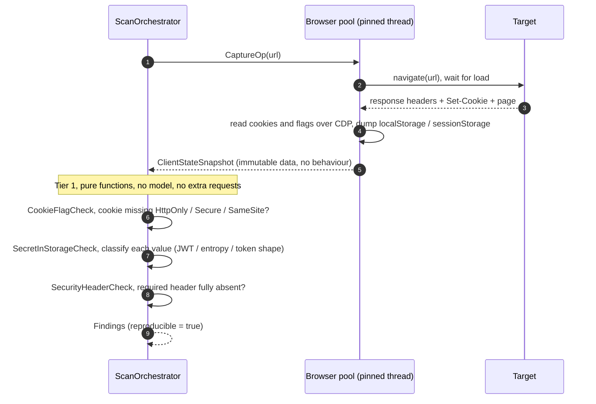
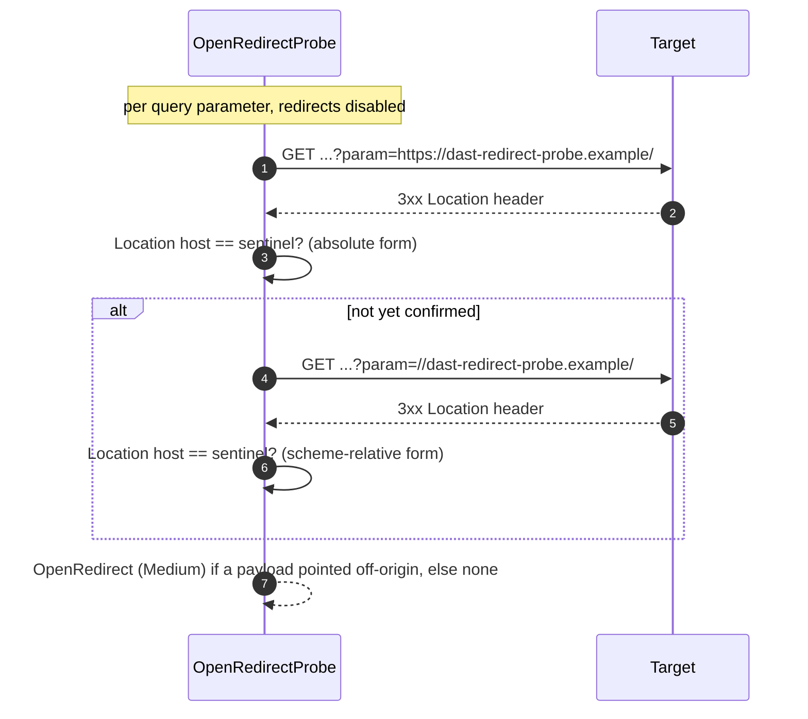
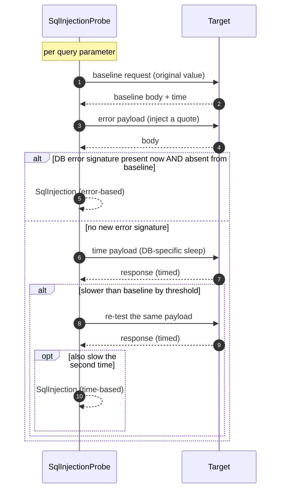
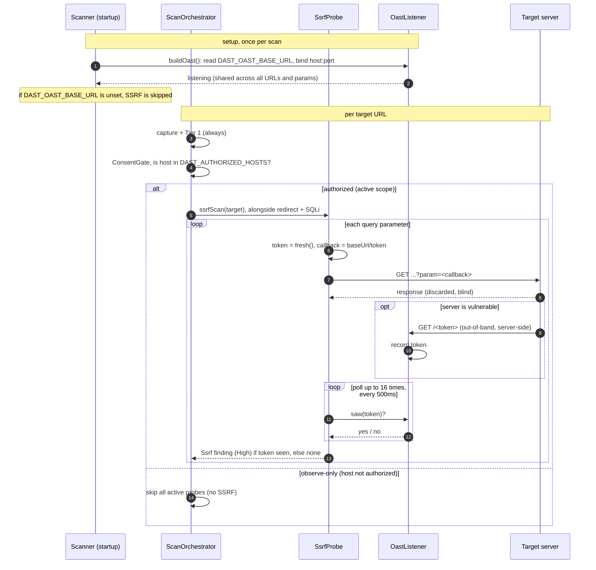
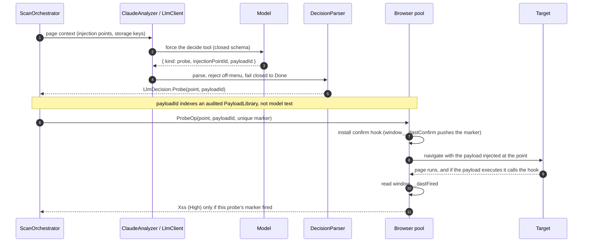
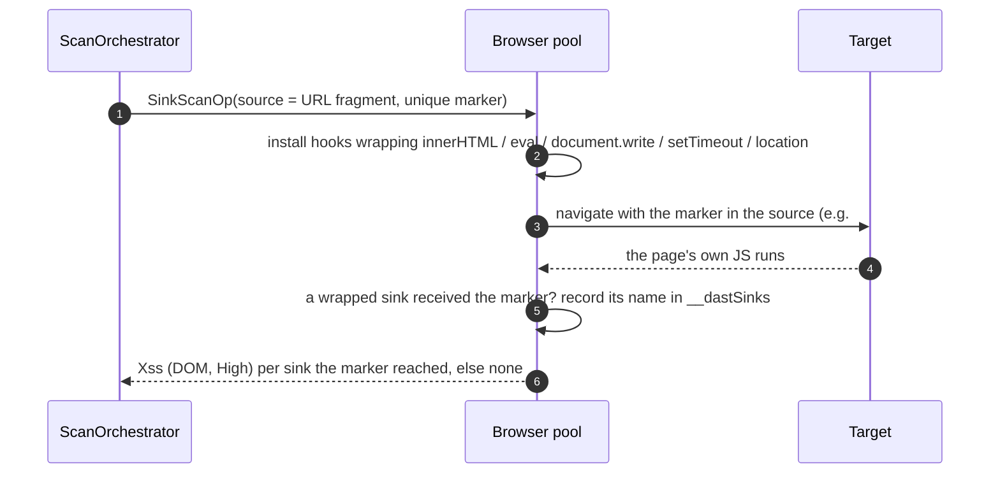
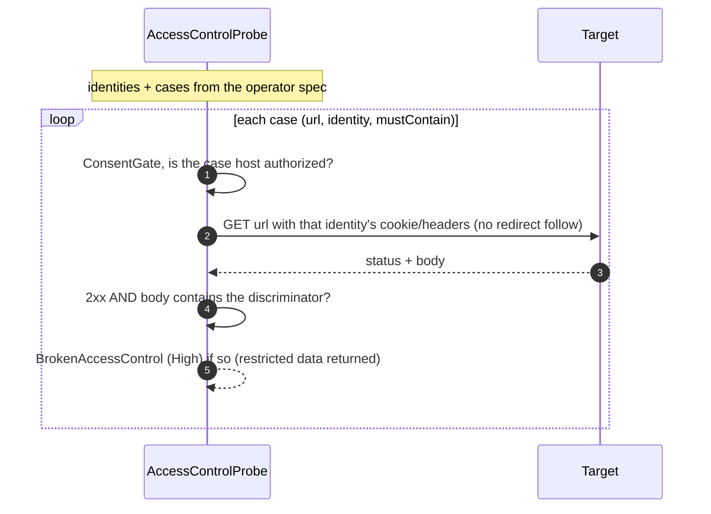
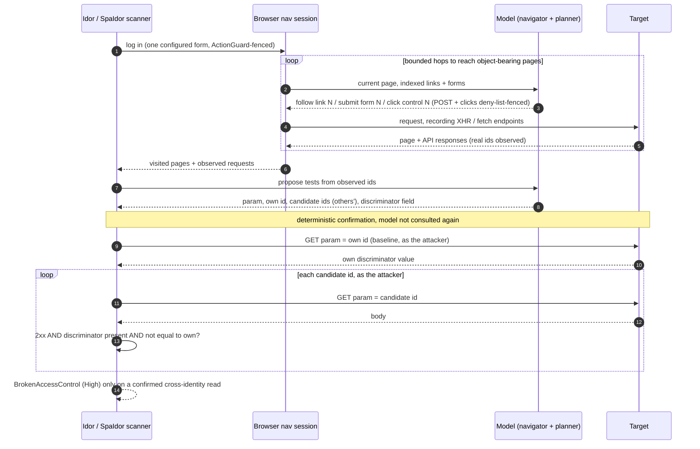

English | [日本語](README.ja.md)

# pekko-dast

**New to this?** A web app can expose data or hand control to an attacker in ways that only show up while it's running — a page that follows a booby-trapped link, an API that returns another user's record, a cookie any script can read. This tool plays the part of a careful attacker against a site you own or are allowed to test: it drives a real browser, tries a bounded menu of probes (only ever against hosts you explicitly authorize), and reports only what it could actually confirm — each finding comes with the evidence and an exact way to reproduce it, never a bare guess. It's for developers and security engineers who want repeatable, proof-backed results. Unfamiliar acronym? The [glossary](#glossary) decodes every one used below.

A browser-driven, LLM-directed **dynamic application security testing (DAST)** engine built on [Apache Pekko](https://pekko.apache.org/) and [Playwright](https://playwright.dev/java/). It scans one authorized URL (or crawls a seed and scans each in-scope URL), composing deterministic security checks with execution-confirmed active probes, and emits structured, reproducible findings.

It drives a real Chromium browser where one is needed (capture, XSS execution, authenticated single-page-app (SPA) navigation and login) and plain HTTP where it is not (open redirect, SQLi, SSRF, IDOR confirmation). Two stances hold throughout: it is **observe-only until you authorize a host** (active probing is gated by `ConsentGate` on `DAST_AUTHORIZED_HOSTS`), and **the model only proposes; deterministic code confirms** (the LLM fills a closed tool schema, never authors executed code, and no finding exists without a deterministic confirmation). To run it, jump to [Running a scan](#running-a-scan).

---

## What it finds

| Check | Kind | Tier | Confirmation | Browser? | LLM? |
|---|---|---|---|---|---|
| Insecure cookies | `InsecureCookie` | deterministic | cookie flags read over CDP | yes (capture) | no |
| Secrets in storage | `SecretInStorage` | deterministic | key/value classification | yes (capture) | no |
| Missing security headers | `MissingSecurityHeader` | deterministic | response headers read | yes (capture) | no |
| Open redirect | `OpenRedirect` | active, gated | no-follow request, `Location` targets a sentinel | no (HTTP) | no |
| SQL injection | `SqlInjection` | active, gated | error signature vs baseline, or re-tested time delay | no (HTTP) | no |
| SSTI (server-side template injection) | `Ssti` | active, gated | distinctive arithmetic evaluates server-side (not reflected) | no (HTTP) | no |
| Path traversal / LFI | `PathTraversal` | active, gated | a known OS-file signature comes back (absent from baseline) | no (HTTP) | no |
| CORS misconfig | `Cors` | active, gated | a forged `Origin` is reflected (worst with credentials) | no (HTTP) | no |
| JWT weakness | `JwtWeakness` | deterministic | `alg:none`, or a weak HMAC secret cracked offline | yes (capture) | no |
| SSRF | `Ssrf` | active, gated | out-of-band callback to a listener we control | no (HTTP) | no |
| Reflected XSS | `Xss` | active, gated | payload executes in the browser (marker fires) | yes | yes (directs) |
| DOM XSS (sink reach) | `Xss` | active, gated | injected marker reaches a dangerous DOM sink | yes | no |
| Access control / IDOR (spec) | `BrokenAccessControl` | active, gated, assisted | request as an identity returns restricted data | no (HTTP) | no |
| IDOR (LLM-planned) | `BrokenAccessControl` | active, gated | a record that is not the caller's own comes back | login + nav + clicks | yes (plans, navigates, clicks) |

---

## Glossary

A quick decoder for the acronyms and security terms used throughout. Skip it if they're old friends.

- **DAST** — *Dynamic Application Security Testing*: probing a **running** app from the outside, as a user or attacker would, rather than reading its source code.
- **Deterministic** — same input always yields the same result, with no model in the loop. These are the findings you can fully trust.
- **LLM** — *Large Language Model* (e.g. Claude). Here it only **proposes** next steps from a fixed menu; deterministic code does every actual confirmation, so a wrong guess can't become a false finding.
- **XSS** — *Cross-Site Scripting*: getting the victim's browser to run attacker-supplied script. **Reflected** XSS arrives in the request (a crafted link); **DOM-based** XSS happens entirely inside the page's own JavaScript.
- **SQLi** — *SQL Injection*: user input is concatenated into a database query and changes the query itself.
- **SSRF** — *Server-Side Request Forgery*: tricking the **server** into making a request to a destination the attacker chooses (e.g. internal services or cloud metadata).
- **SSTI** — *Server-Side Template Injection*: input is evaluated by the server's template engine instead of being treated as plain data.
- **IDOR** — *Insecure Direct Object Reference*: change an id in a request (`?id=123` → `124`) and receive someone else's data. The common form of **broken access control**.
- **LFI / path traversal** — *Local File Inclusion*: coaxing the app into reading files it shouldn't (e.g. `../../etc/passwd`).
- **CORS** — *Cross-Origin Resource Sharing*: the browser's rules for which other origins may read a response; a misconfiguration can leak data across sites.
- **JWT** — *JSON Web Token*: a signed token used for sessions; weak or missing signing lets one be forged.
- **CSRF** — *Cross-Site Request Forgery*: a forged request that rides on a logged-in user's session.
- **SPA** — *Single-Page Application*: a site whose UI is driven by JavaScript (React, Vue, …), often calling background APIs that no link points to.
- **XHR / fetch** — the browser APIs a SPA uses to make those background API calls.
- **CDP** — *Chrome DevTools Protocol*: the low-level channel used here to read cookie flags and storage.
- **OAST** — *Out-of-band Application Security Testing*: confirming a "blind" bug by watching a listener you control receive a callback.
- **Source / sink / taint** — a **source** is attacker-influenceable input; a **sink** is a dangerous function (like `innerHTML` or `eval`); **taint** tracking watches whether data flows from a source into a sink.
- **Probe / gated / observe-only** — a **probe** is an active test that sends crafted input. Active probes are **gated**: they run only against hosts you authorize; everything else stays **observe-only** (just reading what a normal visit already exposes).

---

## How each check works

Every active check is gated first: `ConsentGate` permits a probe only when the target host is in `DAST_AUTHORIZED_HOSTS`, otherwise the run is observe-only. The diagrams below assume that gate has passed.

### Capture-based deterministic checks (cookies, storage, headers)

**The attacks.** Three weaknesses a single page load can reveal:

- **Insecure cookies.** A session cookie without `HttpOnly` is readable by JavaScript (so any XSS steals the session); without `Secure` it can leak over plain HTTP; without `SameSite` it rides along on cross-site requests (a CSRF enabler).
- **Secrets in storage.** Apps that stash JWTs, API keys, or access tokens in `localStorage` / `sessionStorage` expose them to any script on the page, unlike an `HttpOnly` cookie. One XSS reads them all.
- **Missing security headers.** Absent `Content-Security-Policy`, `Strict-Transport-Security`, `X-Content-Type-Options`, `Referrer-Policy`, or anti-framing leaves the page without standard defence-in-depth.

**How the tool checks them.** All three are deterministic and read off **one** passive capture. `CaptureOp` loads the page and records an immutable `ClientStateSnapshot` (response headers, cookies with their flags via CDP, and the storage maps). No model, no extra requests, no authorization needed (a normal visit already sees all of this). `Tier1.run` then applies three pure functions: `CookieFlagCheck` (a finding per cookie missing a flag), `SecretInStorageCheck` (classifies each stored value by JWT structure, entropy, and known token shapes, so it flags likely secrets without flagging every base64 blob), and `SecurityHeaderCheck` (flags only fully-absent headers, to keep false positives near zero). Every finding is `reproducible = true`.



### Open redirect

**The attack.** An open redirect is when the app bounces the browser to a URL taken from a request parameter (`?next=`, `?url=`, `?returnTo=`, and many other names) without checking it stays on-site. The link **begins on the trusted domain** and lands on the attacker's, which powers convincing phishing and can leak OAuth tokens through a manipulated `redirect_uri`. On its own it is a stepping stone, so it rates `Medium`.

**How the tool checks it.** Pure HTTP, no browser. For each query parameter already in the URL, `OpenRedirectProbe` injects a sentinel host (`dast-redirect-probe.example`, a reserved non-resolving TLD, so the probe never actually leaves the target) in two shapes: an absolute `https://sentinel/` and a scheme-relative `//sentinel/` (the second defeats naive `startsWith("/")` allow-listing). It sends the request with redirect-following **disabled** and reads the `Location` header; if its host is the sentinel, that parameter controls an off-origin redirect. It is parameter-name-agnostic and tests only params already present in the URL.



### SQL injection

**The attack.** When user input is concatenated into a SQL query instead of parameterised, an attacker can change the query itself: read other rows, dump tables, log in as someone else, or worse. Two tells betray it without needing to see the data: a stray quote breaks the query (the page returns a **database error**), or an injected `SLEEP` / `pg_sleep` makes the response take measurably **longer**.

**How the tool checks it.** Pure HTTP. Per query parameter, against a baseline request, `SqlInjectionProbe` tries two confirmations in order:

1. **Error-based.** Inject a quote; confirm if a known DB error signature appears in the response that was **absent from the baseline** (the baseline comparison avoids flagging an error the page always shows).
2. **Time-based** (only if error-based did not fire). Send a DB-specific sleep payload; confirm only if the injected request is slower than baseline by a threshold **and a re-test is also slow** (one slow response is noise, two is the payload).

First technique to confirm per parameter wins; a failed request never fabricates a hit.



### SSRF (out-of-band confirmation)

**Server-Side Request Forgery** is when an attacker gets the *server* to make a request to a destination they choose. The danger is where the server sits: it can reach internal-only services (`http://localhost/...` admin panels, databases), cloud metadata (`http://169.254.169.254/...`, which hands back IAM credentials), and its requests sail past firewalls and IP allow-lists because they originate from the trusted server. Common sink parameters: `url`, `uri`, `src`, `dest`, `image`, `webhook`, `callback`, `proxy`.

Most SSRF is **blind**: the server makes the request but returns nothing observable, so inspecting the response body is unreliable. The only honest signal is **out-of-band**. Give the target a URL pointing at a listener we control, carrying a unique token, and watch whether our listener gets hit. If it does, the server demonstrably fetched an attacker-chosen URL.

### The flow, end to end

1. **Setup, once per scan.** `Scanner.buildOast` reads `DAST_OAST_BASE_URL`, binds an `OastListener` at that host and port *before any probe runs*, and wires it in as the `ssrfScan` effect. That one listener is long-lived and shared across every URL and parameter in the scan. The base URL must be reachable by the target (loopback for a local target, a public or tunnelled address for a hosted one). If the variable is unset, `ssrfScan` is a no-op and SSRF is skipped, never guessed.
2. **Gate, per target URL.** After capture and the Tier-1 checks, `ScanOrchestrator` asks `ConsentGate` whether the host is in `DAST_AUTHORIZED_HOSTS`. Observe-only (host not authorized) skips all active probes, SSRF included.
3. **Run, when authorized.** The three browser-free HTTP probes (open redirect, SQLi, SSRF) fire together; `ssrfScan(target)` calls `SsrfProbe.scan(target, listener)`.
4. **Probe, per query parameter** (parameter-name-agnostic): mint a unique token, inject `baseUrl/token` into that parameter, fire a GET at the target, and **discard the response** (blind SSRF leaks nothing there). Then poll `listener.saw(token)` up to 16 times at 500ms (about an 8-second window for a slow server-side fetch).
5. **Confirm.** If the target's server fetched the callback, the shared listener already recorded the token; the poll sees it and emits a `High` finding whose replay handle is the token. No callback within the window means no finding. The unique-per-parameter token attributes any callback to exactly that input.



**Limitations:** existing query parameters only (no body or path SSRF, no parameter discovery), GET with an HTTP callback only (SSRF that triggers only a DNS lookup is not caught), the poll window can miss a very slow server-side fetch, and it confirms the vulnerability but does not escalate it (no metadata read or internal port scan).

### Reflected XSS (the LLM directs; the browser confirms)

**The attack.** Reflected cross-site scripting: the app echoes a request parameter back into the page without encoding it, so an attacker-crafted value becomes live script in the victim's browser. It can steal cookies and tokens, act as the user, or rewrite the page. "Reflected" means the payload travels in the request (a crafted link the victim clicks), not stored on the server.

**How the tool checks it.** This is the one check the model *directs*, but it never authors code. `ClaudeAnalyzer` sends the page context and forces the closed `decide` tool; the model may return `Probe(injectionPoint, payloadId)`, where `payloadId` indexes an **audited `PayloadLibrary`** (the model picks an id, never payload text). `DecisionParser` rejects anything off-menu and fails closed to `Done`. Then the deterministic part runs on the browser thread: `ProbeOp` installs a confirm hook (`window.__dastConfirm(marker)` pushes a unique marker), navigates with the chosen payload injected at the point, and reads back `window.__dastFired`. A finding exists **only if the probe's marker is in the fired set**, that is, the payload actually executed. The replay handle is the injection point plus payload id, so it reproduces with no model call.



### DOM XSS (sink reach)

**The attack.** DOM-based XSS happens entirely client-side: the page's own JavaScript reads attacker-influenceable input (the URL fragment, query string, `postMessage`, the "source") and writes it into a dangerous "sink" (`innerHTML`, `eval`, `document.write`, string `setTimeout`, `location`) without sanitising it. No server reflection is involved, so server-side checks miss it entirely.

**How the tool checks it.** By **taint observation**, not by firing a payload. `SinkScanOp` installs an init script that wraps the dangerous sinks so each records its name if it ever receives a value containing a **unique, benign, alphanumeric marker** (inert: no markup, no state change). It delivers that marker through a source (the URL fragment), lets the page's own JS run, then reads back `window.__dastSinks`. If the app routed the marker from the source into a sink, that source-to-sink flow is a reproducible DOM-XSS indicator. The marker only proves *reachability*, which is why it stays benign rather than executable. Replay is source plus sink.



### Access control / IDOR (operator spec, assisted)

**The attack.** Broken access control is when the app fails to check that the caller is allowed to do what they asked. **IDOR** (Insecure Direct Object Reference) is the common form: change an id in a request (`/account?id=123` to `124`) and get someone else's data. Related shapes are a low-privilege user reaching an admin URL, or an unauthenticated request reaching a protected page.

**How the tool checks it.** This is the one **assisted** check, because a scanner cannot know what *should* be restricted. The operator supplies a JSON spec of identities (each a captured `cookie` / `headers`, or a `login` form the scanner submits once to mint a session) and assertion cases. A case says: requesting `url` AS `identity` (or unauthenticated) must NOT return `mustContain`, a discriminator string proving restricted data came back. `AccessControlProbe` sends one request per case under that identity's credentials, with **redirect-following disabled** (so a bounce to a login page reads as denied, not as success), each gated by `ConsentGate`. A finding is confirmed only on a **2xx whose body contains the discriminator**. Replay is the case name, identity, and URL.



### IDOR (LLM-planned and LLM-navigated)

**The attack.** Broken object-level authorization — IDOR — is the [#1 risk on the OWASP API Security Top 10](https://owasp.org/www-project-api-security/), and the single hardest vulnerability class to detect automatically. Unlike SQLi, XSS, or an open redirect, it has **no syntactic tell**: the vulnerable response is a clean `200 OK`, shaped exactly like a legitimate one, and only the *semantics* of ownership — *this record isn't the caller's* — distinguish it. A scanner cannot pattern-match its way there, which is why IDOR is the class still mostly found by hand. That is what makes deterministically confirming it the interesting problem here. It is the same broken-access-control class as the spec check above, but in the hard setting where that approach cannot reach: object ids are **non-guessable** (random ULIDs / UUIDs, so you cannot enumerate `123` to `124`), and the vulnerable endpoints are **not obvious** (a single-page app's XHR / fetch API that a link crawl never sees). To test it you need *real* ids belonging to a different user, and you need to reach the pages and API calls that carry them.

**How the tool checks it.** This is the one place the model is genuinely load-bearing — but only to *reach and propose*; deterministic code *confirms*. Three stages:

**1 — Reach the objects.** From a login (the authenticated-scan carve-out), the scanner gets to object-bearing pages three ways:

- **`AuthCrawl`** — a deterministic same-host link crawl.
- **`NavLoop`** — the model picks ONE indexed step per hop (follow a link, or submit a form) to reach listings a crawl misses. Every submission passes `ActionGuard`: GET always; POST only when the model flags it safe **and** a destructive-pattern deny-list passes (the model's verdict is necessary, never sufficient).
- **`ClickLoop`** (SPA only) — the browser clicks button-gated UI a link/form crawl can't reach, or scrolls to load more rows. `ClickTargetScanOp` enumerates the visible controls (stamping each `data-dast-id`); the model picks one *by id*, never a selector. The loop is bounded three ways — a shared click budget, a cycle guard keyed on a control's identity (not its re-stamped id), and a dry counter that counts an in-page DOM reveal as progress. Each click is screened by `ClickGuard` and gated by `ConsentGate`.

Throughout, the browser records the XHR / fetch endpoints the app calls.

**2 — Plan.** A planner (`IdorPlanner` / `ContentIdorPlanner`) proposes, **from ids it actually observed**, a parameter, the caller's own value, candidate ids (from a second account, in the two-identity flow), and the per-user discriminator field.

**3 — Confirm (deterministic).** `IdorProbe` / `ContentIdorProbe` baselines the caller's own value, then requests each candidate **as the caller**. Two confirmation signals:

- **JSON API** — the per-user **discriminator field** comes back present and **different** from the caller's own (someone else's record).
- **HTML / SPA** (no clean field to diff) — a **leak marker**, the victim's *data fingerprint*. `ContentIdor.markersFrom` keeps short, distinctive data tokens (emails, brand domains) that appear on the *other* account's pages but **not** the caller's, so shared boilerplate (the app's brand, CDNs) drops out. A finding needs one to surface in a candidate's response **and** be absent from the caller's baseline — the victim's own data crossing the boundary.

A marker equal to an id in play is rejected (ids echo back regardless of any leak, proving nothing), so the verdict rests on *data*, never the key you queried with. The model cannot fabricate a finding (a secured endpoint yields no diff) and cannot fire a destructive action (the deny-list floor). Replay is the parameter, value, and field — no model needed.



A finding carries kind, severity, evidence, a `reproducible` flag, and a `replay` handle that reproduces it without the model (for example `header:content-security-policy@<url>`).

---

## Architecture

Playwright Java's driver is single-threaded, so the browser is hosted on a **thread-affine resource pool**; the rest of the engine is the deterministic checks and the LLM seam the diagrams above reference.

- **`ResourcePool[R]` / `ResourceSession[R]`** (`src/main/scala/crawler/pool`) - a generic node-local pool. Each session owns one `AutoCloseable` resource on its own `PinnedDispatcher` thread and runs all submitted work there; callers get a typed `Future[T]` via `pool.submit`. Total Chromium processes equal the pool size regardless of scan concurrency, and every Playwright call stays on the thread that created the browser.
- **`BrowserResource`** (`src/main/scala/crawler/BrowserResource.scala`) - one Playwright + Chromium pinned to one thread. Identifiable launch (a `pekko-dast-scanner` user agent and `X-Scanner` header, not stealth), the `withPage` capture op, and a persistent `nav*` session for cookie/login-driven multi-hop SPA navigation (link-follow, form-submit, and `ClickGuard`-fenced clicking of enumerated controls).
- **`dast.analyzer.LlmClient`** - the single boundary to any model: `callTool(system, user, ToolSpec, maxTokens) -> Option[tool-input]`, fail-closed to `None`. Implementations for Anthropic (default), OpenAI, and Gemini, chosen by `DAST_LLM_PROVIDER`. Because it returns only tool arguments and confirmation is deterministic, provider choice affects recall, not soundness.
- **`dast.scan.*`** - orchestration: per-URL scan, site crawl, and the IDOR flows, with `Authorization`/`ConsentGate` enforcing scope.

A note on weight: Pekko is heavier than scanning a handful of URLs strictly needs. It buys clean concurrency and the pinned-thread invariant; a simpler runtime would also serve.

---

## What is validated, and what is not

- **Validated live (against a consenting or local target):** insecure cookies, reflected XSS, open redirect, error-based SQLi, out-of-band SSRF, access control / IDOR, SSTI, path traversal / LFI, CORS misconfiguration, and JWT weak-secret, confirmed end to end against `scripts/vuln-target.py` (which exposes `/?q=` XSS, `/redirect?next=` open redirect, `/item?id=` SQLi, `/fetch?url=` SSRF, `/account?id=` IDOR, `/admin` missing auth, `/greet?name=` SSTI, `/download?file=` path traversal, `/api/data` CORS, and a weak-secret JWT cookie).
- **Unit tested (pure logic):** every check's decision logic — including SSTI (evaluation vs reflection), path traversal (OS-file signatures), CORS (origin/credentials verdict), and JWT (`alg:none` + offline HMAC weak-secret cracking) — the decision parser, scope/frontier, the orchestration loop with stubbed effects, each LLM provider's request builder and response parser, and the click loop (its budget / cycle / dry guards with injected effects, the `ClickStep` parse/render boundary, and the `ClickGuard` destructive floor and `ClickOp` gate).
- **Live-only (stated, not unit tested):** the browser-driving ops, the HTTP probers, the OAST listener, and the live model calls. Only the Anthropic client has run against a real endpoint; the OpenAI and Gemini clients are wired and parse-tested but not yet exercised live. The click ops on a live page (`navEnumerateClickables` / `navClick`) are run-only; clicking has been exercised live against a real authenticated SPA (it fired and revealed button-gated state), but **not** against the bundled `scripts/vuln-target.py`, which is server-rendered and has no JS-gated controls.
- **Implemented and unit tested, not observed firing live:** time-based SQLi and the DOM sink-scan.

---

## Running a scan

> Only scan systems you are authorized to test. Active probing happens only against hosts you list in `DAST_AUTHORIZED_HOSTS`; everything else is observe-only (read cookies, storage, and response headers, nothing more).

### Prerequisites

- JDK 21+ and sbt 1.10+ (Scala 3 / Pekko / Playwright are managed by the build).
- First run downloads Chromium into `~/.cache/ms-playwright` (a few minutes, instant thereafter).

### Configure `.env`

Copy the template and fill it in — `cp .env.example .env`. `DastConfig` reads `.env` as `KEY=VALUE` (resolution order: real env var, then `.env`, then JVM `-D` property), so no `export` is needed. `.env` is gitignored; keep secrets in it. `.env.example` lists every key with placeholders; the essentials:

```dotenv
ANTHROPIC_API_KEY=sk-ant-...
DAST_AUTHORIZED_HOSTS=target.example   # empty = observe-only (no active probing)
# DAST_OAST_BASE_URL=http://your-oast-listener
# DAST_LLM_PROVIDER=anthropic   # or: openai (OPENAI_API_KEY) / gemini (GEMINI_API_KEY)
```

| Key | Default | Used by | Meaning |
|---|---|---|---|
| `DAST_LLM_PROVIDER` | `anthropic` | all LLM-directed steps | Which API the planners call: `anthropic` / `openai` / `gemini`. |
| `ANTHROPIC_API_KEY` | (none) | analyzer, IDOR/nav planners | LLM-directed steps (XSS direction, IDOR planning, nav). Absent: those steps fail closed and are skipped; deterministic checks still run. |
| `ANTHROPIC_MODEL` | `claude-sonnet-4-6` | analyzer, planners | Model id (when provider is `anthropic`). Sonnet is the default: it confirms the cross-account IDOR step (a scan's hardest judgment) at ~1/5 of Opus's token cost, where the cheaper Haiku tier was seen to miss it. Set `claude-opus-4-8` for maximum reasoning, or a Haiku tier to minimise cost. |
| `OPENAI_API_KEY` / `OPENAI_MODEL` | (none) / `gpt-4o` | when provider is `openai` | OpenAI key and model. |
| `GEMINI_API_KEY` / `GEMINI_MODEL` | (none) / `gemini-2.0-flash` | when provider is `gemini` | Gemini key and model. |
| `DAST_AUTHORIZED_HOSTS` | (none -> observe-only) | all scanner mains | Comma-separated hosts that may be actively probed. |
| `DAST_OAST_BASE_URL` | (none -> SSRF skipped) | SSRF check | Base URL of an out-of-band listener the target can call back to. |
| `DAST_ACCESS_SPEC` | (none) | Access / Idor / SpaIdor mains | Fallback spec path if you do not pass one as an argument. |
| `DAST_NAV_TIMEOUT_MS` | `30000` | mains that navigate | Per-navigation timeout. |
| `DAST_MAX_PAGES` | `20` | Site, Idor | Crawl page cap. |
| `DAST_MAX_DEPTH` | `2` | Site, Idor | Crawl depth. |
| `DAST_MAX_HOPS` | `4` (Idor) / `6` (SpaIdor) | Idor, SpaIdor | LLM navigation hops. |
| `DAST_POST_BUDGET` | `3` | Idor, SpaIdor | Max POST navigation actions per run. |
| `DAST_MAX_CLICKS` | `8` | SpaIdor | Click budget shared across pages for button-gated exploration (`0` disables clicking). |
| `DAST_EVIDENCE_FILE` | (none -> off) | all scanner mains | Path to write a JSON-Lines evidence transcript: every target HTTP request (with its injected payload, response status/headers/timing) and each XSS verdict, so a scan's work is provable and replayable. Off when unset. |
| `DAST_REPORT_FILE` | (none -> off) | all scanner mains | Path to write a self-contained HTML report: the findings (severity, evidence, replay handle) plus the evidence transcript above, in one file you can open in a browser or share. Read-only view of output the scan already produced -- no server. Off when unset. |
| `DAST_TRACE_DIR` | (none -> off) | browser-driving mains | Directory for a per-session **Playwright trace** of the authenticated browser session (screenshots, DOM snapshots, and network, per action). Open with `npx playwright show-trace <zip>` or [trace.playwright.dev](https://trace.playwright.dev) -- proof the scan really drove Chromium, useful for debugging a thin crawl. Off when unset. |
| `DAST_VIDEO_DIR` | (none -> off) | browser-driving mains | Directory for a `.webm` **video** of each nav session. Plays in any browser with no tooling -- handy for a demo clip; the trace is richer for debugging. Off when unset. |
| `DAST_MAX_CONCURRENCY` | `4` | global HTTP throttle | In-flight request cap against the target (backpressure). |

Switching provider is a config change, not code (all three go through the one `LlmClient` seam), and because confirmation is deterministic the provider affects recall, not soundness. Note on data: whichever provider you pick, the planners send authenticated page HTML and observed request URLs (with real object ids) to that API, so treat the choice as a privacy decision.

### The identity spec

The IDOR and access-control scanners need to act *as someone*. That comes from a JSON spec (kept in a gitignored `*.local.json`), parsed by `AccessControlCheck.parseSpec`:

```json
{
  "identities": {
    "attacker": {
      "login": {
        "loginUrl": "https://target.example/login",
        "username": "alice@example.com",
        "password": "..."
      }
    },
    "victim": {
      "cookie": "session=eyJ...; csrf=..."
    }
  },
  "cases": [
    {
      "name": "advertiser reads another advertiser's campaign",
      "url": "https://target.example/api/campaign?id=VICTIM_ID",
      "identity": "attacker",
      "mustContain": "\"ownerId\":\"victim\""
    }
  ]
}
```

Each **identity** gives a session one of two ways (pick one):

- **`cookie`** - a raw `Cookie` header value copied from your browser's devtools after logging in. Most reliable (no MFA or field-detection issues), and no password in a file. `headers` (e.g. `{"Authorization": "Bearer ..."}`) works the same way for token auth.
- **`login`** - `loginUrl` + `username` + `password`; the scanner drives that one real login form (the only auto-submit it performs; field detection is deterministic).

How the two consumers use it:

- **`AccessScannerMain`** runs the **`cases`** array. Each case requests `url` as `identity` (or unauthenticated when `identity` is `null`) and is a finding if the response is 2xx and its body contains `mustContain`. `cases` may be empty.
- **`IdorScannerMain` / `SpaIdorScannerMain`** ignore `cases` and use the **identities** only: one named `attacker` (or the lone identity if there is exactly one) and an optional `victim`. With a `victim` it is a two-identity test: log in as both, harvest the victim's object ids, then try to read them while authenticated as the attacker.

Two ready-to-copy specs ship in `scripts/`: **`idor-spec.example.json`** — an annotated template covering all three auth methods (`login` / `cookie` / `headers`), the `attacker`/`victim` two-identity setup, and `cases` — and **`access-spec.example.json`**, a minimal one wired to the bundled demo target (`vuln-target.py`). Copy either to a gitignored `*.local.json` and fill in real values.

### Choosing the seed URL

For `ScannerMain` / `SiteScannerMain` the URL argument is simply the page (or crawl seed) to scan, including any query string you want probed (`...?id=1&q=x`).

For `SpaIdorScannerMain` / `IdorScannerMain` the URL is the page to **explore after login** - the login itself comes from the spec's `loginUrl`, not this argument. Pick the page where your objects live (the one you land on after logging in; copy it from your address bar). If unsure, pass the app root: a fallback navigates back to wherever login actually landed you if `/` bounces to `/login`.

### Run

All in one sbt session via the launcher:

```bash
# per-URL battery + in-scope crawl (observe-only unless the host is authorized)
./scripts/scan.sh https://target.example/path?q=1

# add two-identity access + browser IDOR by passing a spec
./scripts/scan.sh https://target.example/app spec.json
```

Or run a single entry point directly:

| Main | Args | Does | Needs |
|---|---|---|---|
| `dast.scan.ScannerMain` | `<url>` | Capture + security headers + analyzer-directed active probes. | key for XSS |
| `dast.scan.SiteScannerMain` | `<seed>` | Crawl in-scope URLs, scan each, aggregate per URL. | key for XSS |
| `dast.scan.AccessScannerMain` | `<spec.json>` | Run the spec's `cases` (HTTP, two-identity access control). | spec |
| `dast.scan.IdorScannerMain` | `<url> <spec.json>` | LLM-planned IDOR over an HTTP cookie-jar session. | spec, key |
| `dast.scan.SpaIdorScannerMain` | `<url> <spec.json>` | Two-identity IDOR driving a real browser (SPA targets). | spec, key |

```bash
sbt "runMain dast.scan.SpaIdorScannerMain https://target.example/ spec.json"
```

To see it work with zero external impact, run the bundled deliberately-vulnerable target: `scripts/demo.sh` starts `scripts/vuln-target.py`, runs every scanner against `localhost` (the authorized scope), and stops it.

```bash
./scripts/demo.sh
```

### Reading the report

Each main prints a JSON report to stdout:

```json
{
  "target": "https://target.example/path",
  "findingCount": 1,
  "findings": [
    {
      "kind": "MissingSecurityHeader",
      "severity": "Medium",
      "evidence": "response is missing the 'content-security-policy' header (no declarative defence-in-depth against script injection)",
      "reproducible": true,
      "replay": "header:content-security-policy@https://target.example/path"
    }
  ]
}
```

`SiteScannerMain` emits a site report instead: `seed`, total `findingCount`, and a `pages` array of `{ url, findings }`. Each finding has a `kind` (`InsecureCookie`, `SecretInStorage`, `MissingSecurityHeader`, `OpenRedirect`, `SqlInjection`, `Ssti`, `PathTraversal`, `Cors`, `JwtWeakness`, `Ssrf`, `Xss`, `BrokenAccessControl`), a `severity`, one line of `evidence`, a `reproducible` flag (true when confirmed, not merely suspected), and a `replay` handle that reproduces it without the model (e.g. `header:content-security-policy@<url>` or `access case='...' as=attacker url=...`).

A run with `"findingCount": 0` is a real result, not a failure: for the IDOR scanners it means the app enforced ownership and no cross-account record came back.

### HTML report

Set `DAST_REPORT_FILE` to also write a self-contained HTML view of the run — the same findings plus the opt-in evidence transcript (`DAST_EVIDENCE_FILE`), in one file you can open in a browser or hand off. It is a read-only render of output the scan already produced: no server, and off unless the variable is set.

```bash
DAST_AUTHORIZED_HOSTS=… DAST_EVIDENCE_FILE=/tmp/ev.jsonl DAST_REPORT_FILE=/tmp/report.html \
  sbt -batch "runMain dast.scan.SpaIdorScannerMain <url> <spec>"
```


<sub>Placeholder data — `target.example` / `victim-co.example` are reserved example domains, not a real finding.</sub>

### Notes

- **No `ANTHROPIC_API_KEY`?** Deterministic checks (headers, cookies, storage, open redirect, SQLi, SSRF, spec-driven access control) still run; only the LLM-directed steps (XSS direction, IDOR planning) are skipped.
- **SSRF not firing?** Set `DAST_OAST_BASE_URL` to a listener the target can reach; without it, out-of-band confirmation is skipped.
- **Everything came back observe-only?** The target host is not in `DAST_AUTHORIZED_HOSTS`.

---

## Build and test

```bash
sbt test        # whole suite is deterministic: no browser, network, or model
```

`crawler.pool.ResourcePoolSpec` asserts the core invariant (work runs on the resource's construction thread); if you touch the pool, that spec must stay green. scalafmt is configured (`.scalafmt.conf`); run it rather than hand-formatting. A live scan needs an authorized target (and an API key for the LLM-directed paths).
